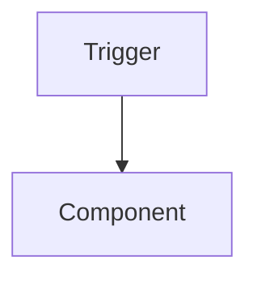

<!-- ALDC Core Template — IMMUTABLE. Do NOT edit this file directly.
     Copy to .github/plans/{req_name}/{req_name}.architecture.md and fill in. -->

# Architecture: {Feature Name}

**Date**: YYYY-MM-DD
**Complexity**: [LOW / MEDIUM / HIGH]
**Author**: al-architect
**Status**: [Proposed / Approved / Implemented / Superseded]

> **Skills applied**: {list skills loaded during design — e.g. `skill-api, skill-events, skill-performance` — or write "None (general architecture patterns only)"}
> *(List only skills actually loaded. The Conductor and Review Subagent use this for downstream traceability.)*

---

## 1. Executive Summary

{2-3 sentence overview describing what the feature is, what it solves and the high-level approach.}

## 2. Business Context

### Problem Statement

{Describe the pain point or unmet need that justifies this work.}

### Success Criteria

| ID | Criterion | Observable |
|----|-----------|------------|
| AC-01 | {Outcome the business expects} | {How we will verify it} |

## 3. Solution Architecture

{Explain the chosen pattern (event-driven extension, stored fields vs FlowFields, etc.) and *why*. Include 1-3 Mermaid diagrams showing data flow, process flow and/or object relationships. Diagrams must add information that prose cannot — do not duplicate the diagram in a table.}

## 4. Data Model

{Tables, table extensions, enums — high level with relationships. Include an ER diagram if the relationships are non-trivial.}

| Object | Type | Purpose | Notes |
|--------|------|---------|-------|

## 5. Business Logic

{Codeunits, their responsibilities, event architecture. List public procedures with signatures.}

| Procedure | Visibility | Responsibility |
|-----------|-----------|----------------|

## 6. User Interface

{Pages, page extensions, factboxes, reports. Describe layout decisions and the rationale.}

## 7. Integration Points

{Events subscribed (inbound), events published (outbound), APIs, external systems. Indicate whether each is an existing BC event or a new integration event introduced by this feature.}

## 8. Security Model

{Permission sets, data classification, multi-company considerations.}

| Object | DataClassification | Permission |
|--------|-------------------|------------|

## 9. Performance Considerations

{Identify hotspots, table volume estimates, query strategy (set-based vs iterative), indexing needs, batch processing. Reference `al-performance.instructions.md` and `skill-performance` for execution patterns.}

## 10. Technical Decisions

{Minimum 3 decisions. For each, document the problem, the chosen option, alternatives rejected and the rationale. This section is what makes the document auditable months later.}

### TD-01: {Decision Title}

- **Problem**: {What had to be decided}
- **Decision**: {Chosen approach}
- **Alternatives rejected**: {What else was considered}
- **Rationale**: {Why this is the right call here}

## 11. Implementation Phases

{Ordered list of phases with dependencies and exit criteria. Each phase must be self-contained.}

### Phase 1 — {Title}

| ID | Object | Type |
|----|--------|------|

**Prerequisite for**: {next phases}
**Exit criterion**: {observable definition of done}

## 12. Risks & Mitigations

{Minimum 3 risks. Include likelihood, impact and explicit mitigation.}

| ID | Risk | Likelihood | Impact | Mitigation |
|----|------|-----------|--------|------------|

## 13. Deployment Plan

### Pre-deploy

- [ ] {Check}

### Post-deploy

- [ ] {Check}

### Rollback

{What happens on uninstall, data migration considerations, idempotency.}

## 14. Spec Decomposition

{When this feature requires more than one technical specification, list the sub-specs and their boundaries. Omit the section entirely if not applicable.}

| Spec ID | Scope |
|---------|-------|

---

## Rules

- All 14 sections above are **required** for MEDIUM/HIGH complexity. For LOW complexity, sections 11-14 may be condensed into a single "Plan" paragraph.
- Update the **Status** field as the document evolves: `Proposed` → `Approved` → `Implemented` → `Superseded` (if replaced).
- The `> Skills applied:` line at the top is **mandatory** even when no skill was loaded (write "None" then).
- Do not duplicate content across sections — cross-reference instead.
- Mermaid diagrams must add information that prose cannot.
- Do not include AL code blocks in this document — describe behaviour and link to the future `.spec.md` or to existing files.
