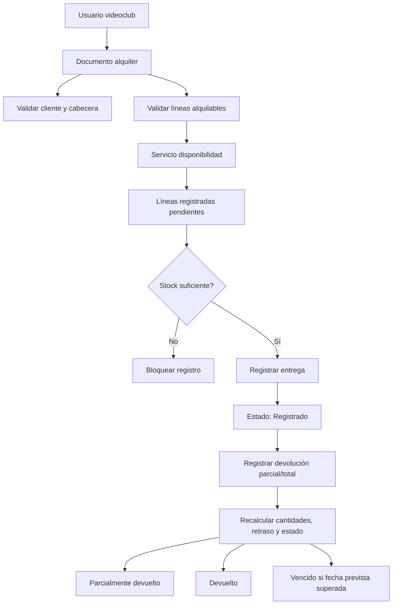
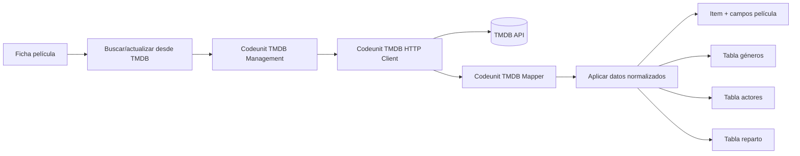
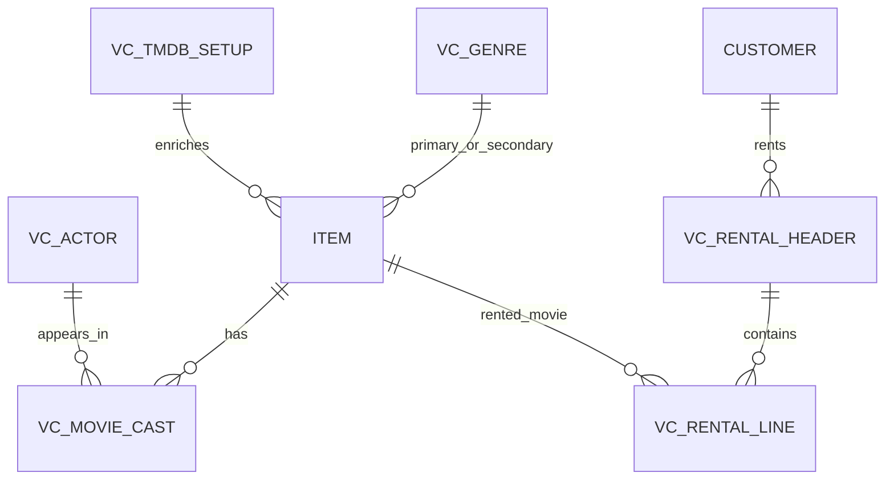

# Architecture: Gestión de videoclub en Business Central

**Date**: 2026-06-18
**Complexity**: HIGH
**Author**: al-architect
**Status**: Proposed

> **Skills applied**: skill-api, skill-events, skill-performance, skill-pages, skill-permissions, skill-testing

---

## 1. Resumen técnico de la solución

La extensión modela un videoclub sobre Business Central con un enfoque SaaS-first, usando artículos estándar como soporte operativo de las películas alquilables y objetos AL propios para la semántica específica del dominio: metadatos cinematográficos, reparto, documentos de alquiler/devolución e integración con TMDB.

La arquitectura propuesta separa claramente maestro, documentos, lógica de negocio e integración externa. Los alquileres se diseñan como documento con cabecera y líneas, con un proceso explícito de registro de entrega y devolución, y con eventos de extensibilidad alrededor de validaciones, cambios de estado e importación TMDB.

No se ha validado contra símbolos de Business Central, no se han descargado símbolos, no se ha compilado y no se ha conectado con ningún entorno. Los nombres e IDs de objetos son decisiones de diseño pendientes de ajustar durante la especificación técnica.

## 2. Contexto funcional y criterios de éxito

La solución cubre los procesos descritos en el documento funcional: catálogo de películas, géneros, actores, reparto, copias disponibles, alquileres, devoluciones y enriquecimiento desde TMDB.

| ID | Criterio | Observable |
|----|----------|------------|
| AC-01 | El usuario mantiene películas como artículos alquilables con datos cinematográficos | Ficha/lista de películas muestra campos de película, géneros, reparto, disponibilidad y acciones TMDB |
| AC-02 | El usuario registra alquileres con una o varias películas | Documento de alquiler con cabecera y líneas pasa de borrador a registrado tras validar cliente, líneas y disponibilidad |
| AC-03 | El usuario registra devoluciones parciales o totales | Las líneas reflejan cantidades/fechas devueltas y el estado de cabecera cambia a parcialmente devuelto o devuelto |
| AC-04 | La disponibilidad impide sobrealquileres | Las validaciones bloquean alquileres por encima de copias existentes menos copias pendientes de devolución |
| AC-05 | TMDB enriquece el catálogo sin acoplarse a la UI | Codeunits de integración obtienen, normalizan y aplican datos mediante servicios y eventos |

## 3. Arquitectura de solución

### 3.1 Patrón general

Se recomienda una arquitectura de extensión compuesta por:

- **TableExtension sobre Item** para marcar artículos como película y almacenar los metadatos necesarios para búsqueda, filtrado y consulta.
- **Tablas propias de dominio** para géneros, actores, reparto, configuración TMDB, documentos de alquiler y líneas.
- **Codeunits de negocio** para validar disponibilidad, registrar entregas, registrar devoluciones y recalcular estados.
- **Codeunits de integración TMDB** para encapsular autenticación/configuración, cliente HTTP, mapeo de respuestas y aplicación de datos.
- **Páginas propias y page extensions** para experiencia de usuario orientada a videoclub sin modificar objetos base.
- **Eventos IntegrationEvent** en los puntos clave para permitir intervención o reacción futura.

### 3.2 Flujo de alquiler y devolución

### 3.3 Flujo de integración TMDB

## 4. Modelo de datos propuesto

### 4.1 Visión ER

### 4.2 Entidades principales

| Objeto | Tipo | Propósito | Notas |
|--------|------|-----------|-------|
| Item | Tabla estándar extendida | Representar cada película como producto BC | Permite reutilizar búsquedas, dimensiones futuras e inventario conceptual |
| VC Genre | Tabla nueva | Maestro de géneros cinematográficos | Relacionada desde campos de película |
| VC Actor | Tabla nueva | Maestro de actores | Fuente de reparto |
| VC Movie Cast | Tabla nueva | Relación N:M película-actor con papel y protagonista | PK compuesta por película y actor/línea |
| VC Rental Header | Tabla nueva | Cabecera de documento de alquiler | Cliente, fechas, estado y numeración |
| VC Rental Line | Tabla nueva | Líneas de películas alquiladas | Cantidades, fechas previstas/reales y estado de devolución |
| VC TMDB Setup | Tabla nueva | Configuración funcional/técnica de TMDB | Credenciales protegidas como decisión pendiente |
| VC TMDB Import Log | Tabla nueva opcional | Auditoría de búsquedas/importaciones TMDB | Recomendado para soporte y trazabilidad |

## 5. Tablas nuevas

### 5.1 VC Genre

| Campo | Tipo recomendado | Descripción |
|-------|------------------|-------------|
| Code | Code[20] | Identificador funcional del género |
| Description | Text[100] | Descripción visible |
| Blocked | Boolean | Bloqueo para no usar en nuevas películas |
| TMDB Genre ID | Integer | Identificador externo opcional |
| System fields | estándar | Auditoría de plataforma |

Claves propuestas: `Code` como PK; clave secundaria `TMDB Genre ID` para sincronización.

### 5.2 VC Actor

| Campo | Tipo recomendado | Descripción |
|-------|------------------|-------------|
| No. | Code[20] | Identificador del actor |
| Name | Text[100] | Nombre completo |
| Birth Date | Date | Fecha de nacimiento opcional |
| Nationality | Text[50] | Nacionalidad funcional |
| TMDB Person ID | Integer | Identificador externo opcional |
| Blocked | Boolean | Bloqueo funcional |

Claves propuestas: `No.` como PK; claves secundarias por `Name` y `TMDB Person ID`.

### 5.3 VC Movie Cast

| Campo | Tipo recomendado | Descripción |
|-------|------------------|-------------|
| Movie Item No. | Code[20] | Relación a Item de tipo película |
| Line No. | Integer | Secuencia del reparto |
| Actor No. | Code[20] | Relación a VC Actor |
| Role | Text[100] | Personaje o rol interpretado |
| Main Cast | Boolean | Indica protagonista/reparto principal |
| TMDB Cast ID | Integer | Identificador externo opcional |

PK recomendada: `Movie Item No., Line No.`. Clave secundaria: `Actor No., Movie Item No.` para consultar filmografía.

### 5.4 VC Rental Header

| Campo | Tipo recomendado | Descripción |
|-------|------------------|-------------|
| No. | Code[20] | Número de alquiler con No. Series |
| Customer No. | Code[20] | Cliente estándar BC |
| Customer Name | Text[100] | Copia descriptiva para consulta |
| Rental Date | Date | Fecha de entrega |
| Status | Enum VC Rental Status | Borrador, registrado, parcialmente devuelto, devuelto, vencido |
| No. Series | Code[20] | Serie usada |
| Open Lines | Integer FlowField | Líneas pendientes de devolución |
| Overdue Lines | Integer FlowField | Líneas vencidas |

PK recomendada: `No.`. Claves secundarias: `Customer No., Rental Date`, `Status, Rental Date`.

### 5.5 VC Rental Line

| Campo | Tipo recomendado | Descripción |
|-------|------------------|-------------|
| Document No. | Code[20] | Relación a cabecera |
| Line No. | Integer | Número de línea |
| Movie Item No. | Code[20] | Película alquilada |
| Description | Text[100] | Título/copía descriptiva |
| Quantity | Decimal | Unidades alquiladas; decisión pendiente si Integer estricto |
| Returned Quantity | Decimal | Unidades devueltas |
| Outstanding Quantity | Decimal FlowField o campo calculado | Cantidad pendiente |
| Expected Return Date | Date | Fecha prevista |
| Actual Return Date | Date | Fecha real cuando la línea queda devuelta |
| Line Status | Enum VC Rental Line Status | Borrador, pendiente, parcialmente devuelta, devuelta, vencida |

PK recomendada: `Document No., Line No.`. Claves secundarias: `Movie Item No., Line Status`, `Expected Return Date, Line Status`.

### 5.6 VC TMDB Setup

| Campo | Tipo recomendado | Descripción |
|-------|------------------|-------------|
| Primary Key | Code[10] | Registro único de configuración |
| Enabled | Boolean | Habilita integración |
| Base URL | Text[250] | URL base TMDB |
| API Key Secret Name / Token Reference | Text[250] | Referencia segura a credencial |
| Default Language | Code[10] | Idioma por defecto para búsquedas |
| Poster Base URL | Text[250] | Base para rutas de póster |

Pendiente: definir mecanismo exacto de almacenamiento de credenciales según versión objetivo y política del cliente.

### 5.7 VC TMDB Import Log (opcional recomendado)

| Campo | Tipo recomendado | Descripción |
|-------|------------------|-------------|
| Entry No. | Integer | Autoincremental |
| Movie Item No. | Code[20] | Película afectada |
| TMDB ID | Integer | Identificador consultado |
| Operation | Enum VC TMDB Operation | Search, Import, Refresh |
| Status | Enum VC Integration Status | Success, Warning, Error |
| Message | Text[2048] | Mensaje resumido |
| Created At | DateTime | Fecha/hora |
| User ID | Code[50] | Usuario ejecutor |

## 6. Extensiones de tablas estándar

### 6.1 Item tableextension

Campos propuestos en Item:

| Campo | Tipo recomendado | Uso |
|-------|------------------|-----|
| VC Is Movie | Boolean | Marca artículos gestionados como película |
| VC Release Year | Integer | Año de lanzamiento |
| VC Director | Text[100] | Director |
| VC Duration Minutes | Integer | Duración |
| VC Primary Genre Code | Code[20] | Género principal |
| VC Secondary Genre Code | Code[20] | Género secundario opcional |
| VC Synopsis | Text[2048] o Blob/Text | Sinopsis; decisión pendiente por límite deseado |
| VC Age Rating | Code[20] | Calificación por edad |
| VC Original Language | Code[10] | Idioma original |
| VC Poster URL | Text[250] | URL/referencia del póster |
| VC TMDB ID | Integer | Identificador externo TMDB |
| VC Rental Copies | Decimal o Integer | Copias físicas existentes para alquiler |
| VC Rented Quantity | Decimal FlowField | Cantidad pendiente de devolución |
| VC Available Quantity | Decimal FlowField o cálculo | Copias disponibles |
| VC Rentable | Boolean | Permite bloquear alquiler aunque sea película |

Decisión propuesta: usar `VC Rental Copies` como stock funcional propio en fase inicial, en lugar de acoplarse a inventario estándar, porque el requisito habla de copias físicas alquilables pero no exige compras, almacenes, ubicaciones ni coste. La integración con inventario estándar queda como evolución posible.

### 6.2 Customer page/table standard

No se recomienda extender la tabla Customer en la primera versión. El histórico de alquileres se resolverá mediante página/lista filtrada por cliente y acción desde Customer Card/List.

## 7. Páginas y page extensions

### 7.1 Páginas nuevas

| Página | Tipo | SourceTable | Propósito |
|--------|------|-------------|-----------|
| VC Movie List | List | Item | Lista filtrada a `VC Is Movie = true`, búsqueda por título y filtros de género/disponibilidad |
| VC Movie Card | Card | Item | Ficha de película con metadatos, póster, disponibilidad y acciones TMDB |
| VC Movie Cast Part | ListPart | VC Movie Cast | Subpágina de reparto en ficha de película |
| VC Genre List | List | VC Genre | Mantenimiento de géneros |
| VC Actor List | List | VC Actor | Lista de actores |
| VC Actor Card | Card | VC Actor | Ficha de actor con datos personales |
| VC Actor Filmography Part | ListPart | VC Movie Cast | Consulta de películas asociadas al actor |
| VC Rental List | List | VC Rental Header | Consulta general de alquileres |
| VC Rental Document | Document | VC Rental Header | Documento cabecera/líneas para crear y registrar alquileres/devoluciones |
| VC Rental Lines Part | ListPart | VC Rental Line | Líneas del documento |
| VC Open Rentals | List | VC Rental Header | Alquileres registrados/parcialmente devueltos |
| VC Overdue Rentals | List | VC Rental Header | Alquileres vencidos |
| VC TMDB Setup Card | Card | VC TMDB Setup | Configuración de integración |
| VC TMDB Import Log | List | VC TMDB Import Log | Auditoría opcional |

### 7.2 Page extensions estándar

| Page extension | Página estándar | Cambio propuesto |
|----------------|-----------------|------------------|
| VC Item Card Ext | Item Card | Añadir FastTab “Videoclub” visible/editable para películas y acción “Abrir ficha película” |
| VC Item List Ext | Item List | Añadir indicador `VC Is Movie` y acción filtrada a películas, si procede |
| VC Customer Card Ext | Customer Card | Acción “Alquileres” y “Alquileres abiertos” filtradas por cliente |
| VC Customer List Ext | Customer List | Acción de navegación a histórico de alquileres |
| VC Role Center Ext | Role Center aplicable | Cues/listas para películas disponibles, alquileres abiertos y vencidos; página exacta pendiente |

## 8. Codeunits de negocio

| Codeunit | Responsabilidad | Procedimientos públicos previstos |
|----------|-----------------|------------------------------------|
| VC Rental Management | Orquestar registro de alquiler y devolución | `RegisterRental(var Header)`, `RegisterReturn(var Header)`, `RegisterLineReturn(var Line, Qty, Date)` |
| VC Rental Validation | Validaciones de cabecera, líneas y cantidades | `ValidateCanRegister(Header)`, `ValidateCanReturn(Line, Qty)` |
| VC Availability Management | Cálculo de copias disponibles y pendientes | `GetRentedQuantity(MovieItemNo)`, `GetAvailableQuantity(MovieItemNo)`, `AssertAvailable(MovieItemNo, Qty, ExcludeDocumentNo)` |
| VC Rental Status Management | Recalcular estados de cabecera/línea | `UpdateHeaderStatus(var Header)`, `UpdateLineStatus(var Line)` |
| VC Movie Management | Utilidades de película | `EnsureMovieItem(Item)`, `ValidateMovieIsRentable(ItemNo)` |
| VC No. Series Management | Inicialización/uso de numeración si se encapsula | `InitRentalNo(var Header)` |

Reglas de diseño:

- La página de documento no debe contener lógica crítica; debe llamar a codeunits.
- Las validaciones deben estar centralizadas para permitir pruebas unitarias.
- No usar `Commit` en el proceso de registro salvo decisión explícita futura.
- La disponibilidad debe calcularse con filtros sobre líneas abiertas, no mediante bucles de UI.

## 9. Codeunits de integración TMDB

| Codeunit | Responsabilidad | Notas |
|----------|-----------------|-------|
| VC TMDB Management | Fachada de integración usada por páginas y procesos | Verifica setup, coordina búsqueda/importación/refresco |
| VC TMDB HTTP Client | Encapsula HttpClient, endpoints, headers y errores técnicos | Sin lógica de aplicación a tablas |
| VC TMDB Mapper | Transforma JSON TMDB a DTOs/registros temporales | Aísla cambios de contrato externo |
| VC TMDB Movie Import | Aplica datos normalizados a Item, géneros, actores y reparto | Debe publicar eventos Before/After |
| VC TMDB Error Handler | Normaliza errores y mensajes de usuario/log | Puede alimentar VC TMDB Import Log |

Diseño de integración:

- Pull bajo demanda desde la ficha/lista de película; no se diseña job queue automático en fase inicial salvo decisión posterior.
- Endpoint y autenticación quedan encapsulados; la UI no conoce URLs ni JSON.
- El póster se almacenará inicialmente como URL/referencia, no como Media/Blob, salvo que se confirme requerimiento de almacenamiento binario.
- Se recomienda separar “buscar candidatos TMDB” de “aplicar datos a película” para permitir revisión por usuario.

## 10. Enums o interfaces necesarias

### 10.1 Enums

| Enum | Valores propuestos | Uso |
|------|--------------------|-----|
| VC Rental Status | Draft, Registered, Partially Returned, Returned, Overdue | Estado de cabecera |
| VC Rental Line Status | Draft, Outstanding, Partially Returned, Returned, Overdue | Estado de línea |
| VC TMDB Operation | Search, Import, Refresh | Log de integración |
| VC Integration Status | Success, Warning, Error | Resultado de integración |
| VC Age Rating Source opcional | Manual, TMDB, Local | Solo si se requiere trazabilidad de calificación |

### 10.2 Interfaces

| Interface | Propósito | Decisión |
|-----------|-----------|----------|
| VC Movie Metadata Provider | Abstraer proveedor de metadatos de película | Recomendado si se prevén proveedores distintos a TMDB |
| VC Availability Provider | Abstraer cálculo de disponibilidad | Opcional; útil si se evoluciona a inventario estándar |

Decisión propuesta: implementar interfaz de proveedor de metadatos si la especificación prevé extensibilidad real; de lo contrario, mantener TMDB como codeunits concretas con eventos para reducir complejidad inicial.

## 11. Eventos y puntos de extensibilidad

### 11.1 Eventos de alquiler

| Evento | Tipo | Momento | Propósito |
|--------|------|---------|-----------|
| OnBeforeRegisterRental(var Header, var IsHandled) | IntegrationEvent | Antes de registrar entrega | Permitir validación/intervención externa |
| OnAfterRegisterRental(Header) | IntegrationEvent | Después de registrar entrega | Reacciones como notificación o auditoría |
| OnBeforeRegisterReturn(var Line, ReturnQty, ReturnDate, var IsHandled) | IntegrationEvent | Antes de devolver línea | Ajustar o bloquear devolución |
| OnAfterRegisterReturn(Line) | IntegrationEvent | Tras devolución de línea | Reacciones posteriores |
| OnBeforeCalculateAvailability(MovieItemNo, var AvailableQty, var IsHandled) | IntegrationEvent | Antes del cálculo | Sustituir cálculo por inventario u otra regla |
| OnAfterCalculateAvailability(MovieItemNo, AvailableQty) | IntegrationEvent | Después del cálculo | Observabilidad/extensiones |
| OnAfterUpdateRentalStatus(Header) | IntegrationEvent | Tras recalcular estado | Integración con workflows/reporting |

### 11.2 Eventos TMDB

| Evento | Tipo | Momento | Propósito |
|--------|------|---------|-----------|
| OnBeforeSearchTMDB(SearchText, var IsHandled) | IntegrationEvent | Antes de llamar a TMDB | Reemplazar búsqueda o cachear |
| OnAfterSearchTMDB(SearchText, ResultCount) | IntegrationEvent | Después de búsqueda | Log/telemetría |
| OnBeforeApplyTMDBMovie(var Item, TMDBMovie, var IsHandled) | IntegrationEvent | Antes de aplicar datos | Ajustar mapeo o bloquear campos |
| OnAfterApplyTMDBMovie(Item) | IntegrationEvent | Tras aplicar datos | Reacciones posteriores |
| OnTMDBRequestFailed(Operation, Message) | IntegrationEvent | Error de integración | Log o notificación |

## 12. Permisos

### 12.1 Permission sets propuestos

| Permission set | Assignable | Perfil funcional |
|----------------|------------|------------------|
| VC VIDEOCLUB READ | Sí | Consulta de catálogo, actores, géneros, alquileres e histórico |
| VC VIDEOCLUB USER | Sí | Operador de videoclub: crea alquileres, registra entregas/devoluciones y mantiene reparto básico |
| VC VIDEOCLUB ADMIN | Sí | Administración: setup TMDB, géneros, actores, borrados controlados y configuración |
| VC VIDEOCLUB BASE | No | Capa base incluida por las anteriores |

### 12.2 Matriz de permisos

| Objeto/dato | READ | USER | ADMIN |
|-------------|------|------|-------|
| Item campos videoclub | R | RIM | RIMD |
| VC Genre | R | R | RIMD |
| VC Actor | R | RIM | RIMD |
| VC Movie Cast | R | RIM | RIMD |
| VC Rental Header | R | RIM | RIMD limitado |
| VC Rental Line | R | RIM | RIMD limitado |
| VC TMDB Setup | - | R | RIMD |
| VC TMDB Import Log | R | RI | RIMD |
| Codeunits negocio | X según rol | X | X |
| Codeunits TMDB | - o X búsqueda | X uso | X configuración/uso |

Notas:

- Evitar Delete para operadores salvo tablas maestras donde el negocio lo autorice; preferir campos `Blocked` para maestros.
- Si se extienden permission sets estándar como `D365 READ` o `D365 BUS FULL ACCESS`, hacerlo con permisos mínimos y documentarlo en la especificación.
- La protección de credenciales TMDB es una decisión pendiente; nunca exponer secretos en páginas a usuarios no administradores.

## 13. Estrategia de tests

### 13.1 Tipos de pruebas AL

| Área | Tipo | Casos principales |
|------|------|-------------------|
| Maestro de películas | Unit/integration | Crear película, validar géneros, marcar no alquilable |
| Disponibilidad | Unit | Calcular disponibles con cero, parcial y total pendiente |
| Registro de alquiler | Integration | Bloquear sin cliente, sin líneas, con película no alquilable o sin stock; registrar correctamente |
| Registro de devolución | Integration | Devolución parcial, total, tardía, exceso de cantidad y doble devolución |
| Estados | Unit/integration | Draft → Registered → Partially Returned → Returned/Overdue |
| TMDB Mapper | Unit con mocks/fakes | Mapear JSON representativo, campos faltantes, géneros y reparto |
| TMDB Management | Integration aislada con cliente fake | Errores HTTP, sin configuración, aplicación de datos |
| Permisos | Manual/checklist o tests si entorno lo permite | Verificar READ/USER/ADMIN por rol |

### 13.2 Diseño para testabilidad

- Codeunits de lógica sin dependencia directa de páginas.
- Separar cliente HTTP TMDB de mapeo/aplicación para permitir dobles de prueba.
- Usar librerías de test propias como `Library - VC Videoclub` para crear cliente, película, actor, alquiler y líneas.
- Usar patrón Given/When/Then en nombres y estructura de tests.
- No diseñar pruebas que dependan de una conexión real a TMDB; los tests deben usar respuestas controladas.

## 14. Riesgos técnicos

| ID | Riesgo | Probabilidad | Impacto | Mitigación |
|----|--------|--------------|---------|------------|
| R-01 | Acoplar copias de videoclub al inventario estándar sin requerimientos de almacén | Media | Alto | Fase inicial con stock funcional propio; evaluar inventario estándar como evolución |
| R-02 | Credenciales TMDB almacenadas de forma insegura | Media | Alto | Definir mecanismo seguro compatible con versión BC objetivo antes de implementar |
| R-03 | Cambios o límites de la API TMDB | Media | Medio | Encapsular HTTP/mapping, log de errores y eventos; evitar lógica TMDB en UI |
| R-04 | Sobrealquiler por cálculo incorrecto de disponibilidad o concurrencia | Media | Alto | Validación centralizada en registro, filtros por líneas abiertas y pruebas de escenarios límite |
| R-05 | Estados vencidos no actualizados si no hay interacción del usuario | Alta | Medio | Calcular vencido dinámicamente en consultas o diseñar job queue si el negocio exige actualización persistida |
| R-06 | Sinopsis/póster exceden límites de campo o requisitos visuales | Media | Bajo/Medio | Decidir Text vs Blob/Media y URL vs almacenamiento binario antes de implementar |

## 15. Decisiones técnicas

### TD-01: Películas como Item extendido

- **Problema**: El funcional indica que cada película se gestionará como producto del catálogo BC.
- **Decisión**: Usar `Item` con `tableextension` y filtro `VC Is Movie`.
- **Alternativas rechazadas**: Tabla `VC Movie` completamente independiente.
- **Rationale**: Reutiliza semántica de catálogo, búsquedas estándar y extensibilidad BC, manteniendo los datos específicos en campos prefijados.

### TD-02: Stock funcional de copias en fase inicial

- **Problema**: Se requiere disponibilidad de copias, pero no gestión completa de inventario.
- **Decisión**: Añadir `VC Rental Copies` y calcular pendientes con líneas de alquiler abiertas.
- **Alternativas rechazadas**: Usar Item Ledger Entries, ubicaciones y diarios de inventario desde la primera versión.
- **Rationale**: Reduce complejidad y evita implicaciones contables/almacén no solicitadas.

### TD-03: Documento alquiler propio, no Sales Order

- **Problema**: El alquiler no es una venta, no exige facturación ni contabilización.
- **Decisión**: Crear `VC Rental Header` y `VC Rental Line` propios.
- **Alternativas rechazadas**: Reutilizar Sales Header/Sales Line con Document Type estándar.
- **Rationale**: Evita efectos colaterales en ventas, posting y contabilidad; permite estados específicos de alquiler.

### TD-04: Integración TMDB encapsulada por capas

- **Problema**: TMDB implica HTTP, credenciales, JSON y datos externos cambiantes.
- **Decisión**: Separar fachada, cliente HTTP, mapper y aplicador de datos.
- **Alternativas rechazadas**: Llamadas HTTP directas desde página o desde `Item` triggers.
- **Rationale**: Mejora testabilidad, seguridad y resiliencia ante cambios de API.

### TD-05: Eventos IntegrationEvent críticos

- **Problema**: Se necesitan puntos de extensibilidad sin modificar código futuro.
- **Decisión**: Publicar eventos OnBefore/OnAfter en registro, devolución, disponibilidad y aplicación TMDB.
- **Alternativas rechazadas**: No publicar eventos hasta que aparezca un consumidor.
- **Rationale**: Los procesos de alquiler e integración son puntos naturales de personalización; los eventos reducen deuda futura.

## 16. Decisiones pendientes

| ID | Decisión pendiente | Impacto |
|----|--------------------|---------|
| DP-01 | Rango de IDs de objetos AL y prefijo/nombre final de app | Bloquea especificación técnica final |
| DP-02 | Versión mínima de Business Central objetivo | Afecta permisos, secretos, APIs disponibles y patrones de test |
| DP-03 | Mecanismo exacto para credenciales TMDB | Afecta seguridad y UX de setup |
| DP-04 | Si la cantidad de copias debe ser Integer estricto o Decimal por coherencia BC | Afecta campos, validaciones y tests |
| DP-05 | Si el estado Vencido debe persistirse o calcularse dinámicamente | Afecta job queue, consultas y estados |
| DP-06 | Si el póster se almacena como URL, Media o Blob | Afecta modelo de datos y páginas |
| DP-07 | Si habrá tarifas, multas, facturación o integración contable en una fase posterior | Puede cambiar relación con ventas/cobros |
| DP-08 | Página Role Center estándar concreta a extender | Depende del perfil de usuario y app base instalada |
| DP-09 | Política de borrado de documentos registrados | Recomendada restricción fuerte, pendiente de aprobación |

## 17. Plan de implementación recomendado

### Fase 1 — Fundaciones y maestros

| ID | Objeto | Tipo |
|----|--------|------|
| F1-01 | VC Genre | Table + List Page |
| F1-02 | VC Actor | Table + List/Card Pages |
| F1-03 | Item tableextension película | TableExtension |
| F1-04 | VC Movie Cast | Table + ListPart |
| F1-05 | VC Movie List/Card | Pages |

**Criterio de salida**: Se pueden crear películas, géneros, actores y reparto manualmente.

### Fase 2 — Alquileres y disponibilidad

| ID | Objeto | Tipo |
|----|--------|------|
| F2-01 | VC Rental Status / Line Status | Enums |
| F2-02 | VC Rental Header / Line | Tables |
| F2-03 | VC Rental Document/List/Open/Overdue | Pages |
| F2-04 | VC Availability/Rental Management | Codeunits |
| F2-05 | Eventos de alquiler | IntegrationEvents |

**Criterio de salida**: Se registran entregas y devoluciones con control de disponibilidad y estados.

### Fase 3 — TMDB

| ID | Objeto | Tipo |
|----|--------|------|
| F3-01 | VC TMDB Setup | Table + Card Page |
| F3-02 | VC TMDB Management/Client/Mapper/Import | Codeunits |
| F3-03 | VC TMDB Import Log | Table + List Page opcional |
| F3-04 | Acciones TMDB en película | Page actions |

**Criterio de salida**: Se puede buscar/importar/refrescar datos de película desde TMDB con errores controlados.

### Fase 4 — Seguridad, UX y pruebas completas

| ID | Objeto | Tipo |
|----|--------|------|
| F4-01 | Permission sets | PermissionSet |
| F4-02 | Page extensions Customer/Item/Role Center | PageExtension |
| F4-03 | Test libraries y test codeunits | Test Codeunits |
| F4-04 | Documentación de configuración | Docs |

**Criterio de salida**: Roles definidos, accesos navegables y suite de pruebas lista para el conductor.

## 18. Plan de despliegue conceptual

### Pre-deploy

- Confirmar versión BC objetivo y rango de objetos.
- Confirmar política de secretos TMDB.
- Confirmar si se instalará en una o varias compañías.
- Preparar No. Series de alquileres o procedimiento de inicialización.

### Post-deploy

- Crear configuración inicial TMDB solo para administradores.
- Cargar géneros base manualmente o mediante importación controlada.
- Asignar permission sets a perfiles READ/USER/ADMIN.
- Validar una película, un alquiler y una devolución en entorno sandbox.

### Rollback

No se recomienda borrar datos operativos automáticamente en uninstall. Si se requiere eliminación, debe diseñarse una política explícita de retención/exportación. Las tablas de documentos registrados deben tratarse como histórico operativo.

## 19. Supuestos y validaciones no realizadas

- Supuesto: Business Central SaaS es el objetivo principal.
- Supuesto: TMDB se usa bajo demanda y no mediante sincronización programada inicialmente.
- Supuesto: Los alquileres no generan facturas, cobros, multas ni movimientos contables.
- Supuesto: El cliente estándar BC ya existe y no requiere campos específicos de videoclub.
- No validado: disponibilidad exacta de eventos estándar ni firmas de objetos base, porque no se descargaron símbolos.
- No validado: compatibilidad de almacenamiento seguro de credenciales con la versión BC destino.
- No validado: límites finales de campo para sinopsis/póster hasta confirmar experiencia de usuario esperada.
